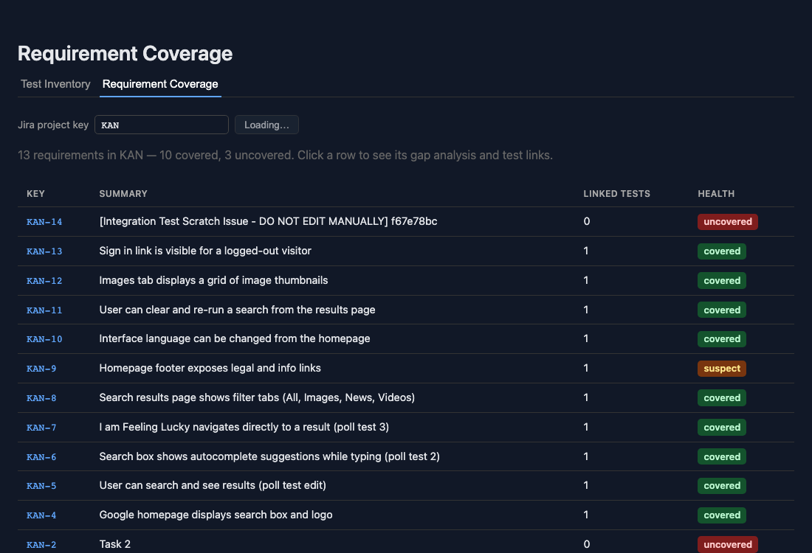

# Playwright Test Inventory Parsers (Milestone 1)



> New to the dashboard? See [`USER_GUIDE.md`](USER_GUIDE.md) for how to
> connect Jira, push test data, and use the Test Inventory / Requirement
> Coverage / Gap Analysis views. This README (and the other `README.md`
> files linked below) are developer/contributor docs, not an end-user guide.

> Milestone 2 (Jira Integration) is complete — see `backend/README.md` for
> the FastAPI service, Jira auth flow, requirement pulling, and JSON
> mapping-file linking (`parser/mapping_parser.py`, issue #9).
>
> Milestone 3 (Traceability Dashboard) is complete — see `frontend/README.md`
> for the dashboard (test inventory, issue #12; requirement coverage,
> issue #13; pass/fail trend, issue #14; flaky-test flagging, issue #15)
> and `backend/README.md` for the endpoints behind it.

Three complementary parsers, covering the first three issues of Milestone 1:

1. `parser/report_parser.py` — parses Playwright's JSON reporter output into
   structured test records (title, file, status, duration). The **primary**
   source of truth: it always has real, resolved test titles and outcomes,
   regardless of whether a test was hand-written, generated in a loop, or
   authored through a BDD layer.
2. `parser/static_parser.py` — statically parses `.spec.ts` source files via
   a TypeScript AST (not regex) to catch what the run report can't: tests
   that never ran (skipped, grep-filtered out), and `Trace(Jira:PROJ-13)`
   -style comment annotations that were never registered as real Playwright
   annotations. This is an **enrichment** layer on top of (1), not a
   replacement for it — see below for why.
3. `parser/feature_parser.py` — parses `.feature` files for BDD/Cucumber
   teams (e.g. `playwright-bdd`), where the human-readable scenario lives in
   Gherkin and the actual Playwright code is in separate step definitions
   that (1) and (2) never see. Also an **enrichment** layer, using
   `gherkin-official` (Cucumber's own parser) for robust parsing.

## Why parse the JSON reporter, not `.spec.ts` source files, as the primary source

The run report always contains real, resolved test titles and outcomes,
regardless of whether a test was hand-written, generated in a loop, or
authored through a BDD layer. A data-driven test built in a loop only gets
real, resolved titles at run time — static source parsing can't know how
many tests a loop produces or what their titles will be, so it deliberately
skips tests with a dynamically-built title rather than guessing.

## Report parser usage

```bash
# From your Playwright project:
npx playwright test --reporter=json > report.json

# From this project:
python -m parser.report_parser report.json
```

This prints a JSON array of flattened test records to stdout.

## What gets extracted per record

Each record is one **(spec × project)** combination — so a test that runs
under both `chromium` and `firefox` produces two records, since they can
have independently different outcomes.

| Field | Source |
|---|---|
| `title` / `full_title` | Spec title, with nested `describe` blocks and the file-level suite title joined by `>` |
| `file`, `line`, `column` | Spec location in source |
| `project` | Which Playwright project (browser) ran it |
| `tags` | Playwright's native `tags` field on the spec |
| `jira_keys` | Extracted from tags, `annotations`, and the title itself, matching patterns like `PROJ-13`, `@PROJ-13`, or `Jira:PROJ-13` |
| `status` | Final attempt's status (`passed`/`failed`/`timedOut`/etc) |
| `duration_ms` | Final attempt's duration |
| `retry_count` | Number of attempts beyond the first |
| `is_flaky` | True if Playwright's own `test.status` is `"flaky"` (failed at least once, but the final attempt passed) |
| `error_message` | First error message from the final attempt, if any |

## Static parser usage

Requires Node.js — the AST walk uses the real TypeScript compiler API
(`static_parser/parse_specs.js`), not regex, so it survives real-world
formatting (multi-line calls, nested describes, etc). Business logic like
Jira-key extraction stays in Python and is reused from `report_parser.py`,
not duplicated in JS.

```bash
cd static_parser && npm install && cd ..
python -m parser.static_parser tests/
```

This prints a JSON array of statically-discovered test records to stdout —
one per `test(...)` definition with a static (non-dynamic) title, including
`test.skip(...)`, `test.only(...)`, and tests nested in `test.describe`
(including `.skip`/`.only` variants). A test with a dynamically-built title
(inside a loop, or interpolated) is intentionally **not** represented here —
see "Why parse the JSON reporter..." above.

| Field | Source |
|---|---|
| `title` / `full_title` | Static string literal title, with nested `describe` titles joined by `>` |
| `file`, `line`, `column` | Location of the `test(...)` call in source |
| `tags` | The `{ tag: ... }` option passed to `test(...)`, if any (string or array) |
| `jira_keys` | Extracted from the tag option, the test's leading comment text, and the title — same regex as `report_parser.py`, so it also catches `Trace(Jira:PROJ-13)`-style comments that never register as a real Playwright annotation |
| `assertions` | Raw source text of every `expect(...)`-rooted call chain in the test body (e.g. `expect(page.getByRole('img')).toBeVisible()`), one entry per assertion, in source order — the evidence Milestone 5's semantic gap detection (issue #21) judges against a requirement's acceptance criteria. Static-only: `.feature` files have no test body to extract from (see the known-gap section above), so `FeatureTestRecord` has no `assertions` field at all. |

## Feature parser usage

Requires `gherkin-official` (see `requirements.txt`) — Cucumber's own
Gherkin parser, implemented in pure Python, so unlike the static parser
this needs no subprocess or Node dependency.

```bash
pip install -r requirements.txt
python -m parser.feature_parser features/
```

This prints a JSON array of scenario records to stdout — one per concrete
`Scenario`, plus one per row of every `Scenario Outline`'s `Examples`
table (values are written directly in the `.feature` file, so unlike a
`.spec.ts` loop, every row *is* fully knowable statically — see "Why parse
the JSON reporter..." above for the contrast). `Background` steps don't
produce their own record. `Rule` blocks aren't supported yet (a rarer
Gherkin 6+ feature) — their scenarios are simply skipped.

| Field | Source |
|---|---|
| `title` / `full_title` | Scenario name, prefixed by the Feature name. For an Examples row, `<placeholder>` values are substituted into the name (mirroring Cucumber's own step-text substitution) and the row's values are also appended as `[key=value, ...]`, since many outlines only reference placeholders in their steps, not the scenario name — without this, every row would otherwise share one identical, ambiguous title |
| `file`, `line`, `column` | Location of the `Scenario` keyword (or, for an Examples row, that row's own location) |
| `tags` | Combined `@tags` from the Feature, the Scenario (or Scenario Outline), and — for an Examples row — that specific Examples block |
| `jira_keys` | Extracted from tags, the scenario's leading comment text, and the title — same regex as `report_parser.py`, so `Trace(Jira:PROJ-13)`-style comments work here too |

## Design notes for whoever picks up the next issue

- `TestRecord`, `StaticTestRecord`, and `FeatureTestRecord` are plain
  dataclasses with no DB dependency on purpose — the Postgres model/ORM
  mapping should live in a separate module that imports these, not be
  merged into them. Keeps this parseable/testable standalone.
- Multi-project specs are intentionally NOT collapsed into one record. If a
  test passes on chromium but fails on firefox, that's a real signal worth
  showing separately, not averaging away — and the dashboard (Milestone 3,
  issue #12) does exactly that, one row per project.
- The static parser identifies Playwright calls purely by the identifier
  name `test` (`test(...)`, `test.describe(...)`, `test.skip(...)`, etc.),
  not by checking the import source. This is a deliberate MVP tradeoff —
  false positives are very unlikely in a file matching `*.spec.ts`, but a
  future issue could tighten this by checking the import statement.
- Reconciling `TestRecord` (from a run) with `StaticTestRecord` /
  `FeatureTestRecord` (from source) — e.g. to show "exists in source but
  never run" — was picked up in Milestone 3, issue #12, exactly the simple
  `(file, title)` match anticipated here. It lives in
  `backend/test_inventory.py` (`build_inventory`), not in this parser
  layer — these three parsers each still just produce their own
  independent record stream; reconciliation happens once the data reaches
  the backend. See `backend/README.md` for the reconciliation rules and a
  real sharp edge it surfaced (file-path conventions have to match across
  parser invocations, or nothing reconciles).
- Zero-test-suite handling (a team with no Playwright tests yet, or none
  matching a given directory) is already graceful at the parser level: all
  three parsers return `[]` rather than raising, for both an empty
  directory and one that doesn't exist at all — the natural state for a
  project that hasn't created a `tests/` folder yet. The one asymmetry is
  intentional: `report_parser.parse_report_file` *does* raise if the report
  file itself is missing, since "no run report was ever generated" is a
  real, distinct usage error — not the same as "the report says zero
  tests ran." A dashboard-level "0% coverage, get started" empty state
  still isn't built — `frontend/`'s two views (issues #12, #13) both
  render *something* for zero data (an empty table / "no requirements
  found"), but neither has dedicated onboarding-style empty-state UI yet.

## Tests

```bash
pip install -r requirements.txt
python -m pytest tests/ -v
```

This runs the whole repo's test suite (142 passing as of Milestone 3,
across the parsers here, `backend/`, and the CLI in `scripts/` — see
`backend/README.md` and `frontend/README.md` for what those add; plus 5
more real-Jira integration tests, skipped unless credentials are
configured, see below). The 40 below are this README's own scope, the
four parser-level files:

`test_report_parser.py` (14): nested describe flattening,
multi-project specs, retry/flakiness detection, and Jira key extraction
across tag/annotation/title sources. `test_static_parser.py` (9): nested
describe flattening, `test.skip`/`test.describe.skip` capture, dynamic-title
exclusion, and Jira key extraction from tag options and `Trace(...)`
comments. `test_feature_parser.py` (9): Feature/Scenario tag combination,
`Trace(...)` comment extraction, and Scenario Outline expansion into one
record per Examples row with combined tags and distinct titles.
`test_zero_test_suite.py` (8): every parser degrades to `[]` gracefully on
an empty or nonexistent test directory / empty run report, never raises.

A separate real-Jira integration suite (`tests/integration/`) talks to a
live Jira site instead of mocks and is skipped by default — see its own
README for why and how to run it.
