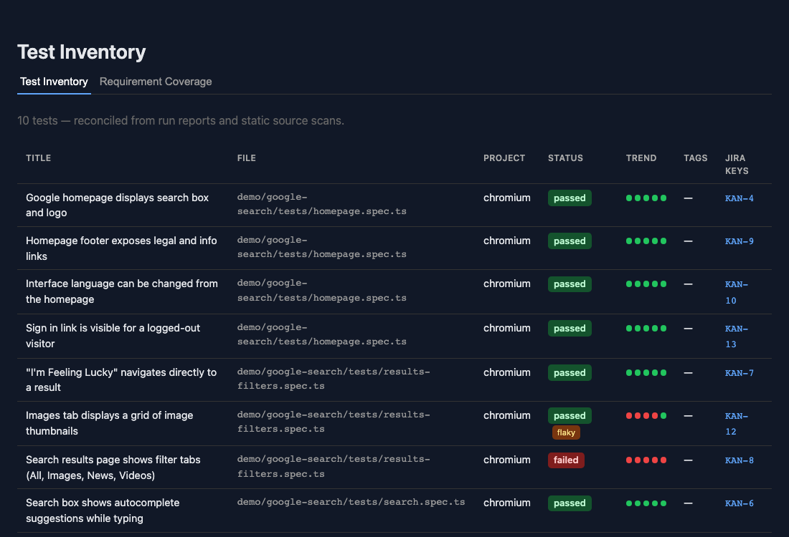
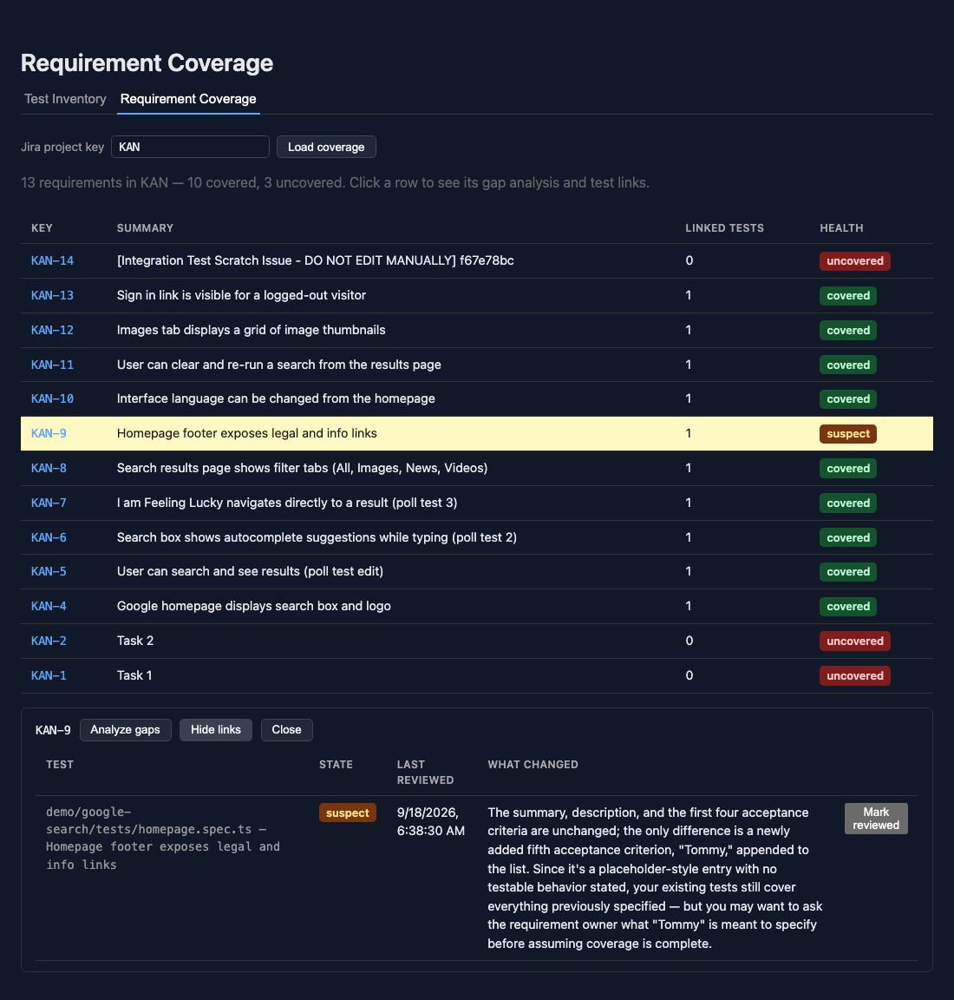

# Playwright Traceability User Guide

_Last updated 2026-09-18._

## Overview

Playwright Traceability answers one question: does this Jira requirement still have a test that actually covers what it asks for? It's built around four ideas:

- **Test Inventory** — every Playwright test the tool knows about, pulled from real run reports and static source scans.
- **Requirement Coverage** — which Jira requirements have at least one linked test, and which don't.
- **Suspect links** — when a linked requirement's content changes in Jira, its test link flips to "Suspect" until a human reviews it. This never clears itself automatically — that's by design, so a real content change can't slip past unnoticed.
- **Gap Analysis** — an AI check of whether a requirement's *individual acceptance criteria* are covered by its linked tests' assertions, not just "some test is linked."

This guide is for QA engineers and team leads who write Playwright tests and track requirements in Jira, and want one dashboard instead of manually cross-checking tickets against test files.

## Getting started: connecting Jira

1. Generate an API token at [id.atlassian.com/manage-profile/security/api-tokens](https://id.atlassian.com/manage-profile/security/api-tokens) (log in as the Jira account you want the tool to read as).
2. Install Python dependencies: `pip install -r requirements.txt` (from the repo root — this one file covers the backend, the parsers, and `scripts/push_test_inventory.py` alike, so you only need to do this once).
3. Start the backend (`uvicorn backend.main:app --reload`) and open its interactive docs at `http://127.0.0.1:8000/docs`.
4. Call `POST /api/jira/connection` with:

| Field | Example |
| --- | --- |
| `site_url` | `https://yourteam.atlassian.net` |
| `email` | the email of the account that generated the token |
| `api_token` | the token from step 1 |

The backend validates the credentials against the real Jira API before storing them, and returns `401` if they're rejected. There's no connection form in the dashboard yet — this one-time setup call is the only step done outside the UI. Once connected, every dashboard tab works without reconnecting.

## Getting your tests in

Run this right after your Playwright suite, typically as a CI step:

```bash
pip install -r requirements.txt  # once per environment; same file the backend uses
export INGEST_API_KEY=...  # set as a CI secret, never in shell history
python -m scripts.push_test_inventory \
  --backend-url https://your-backend.example.com \
  --report report.json \
  --specs-dir tests/ \
  --features-dir features/
```

`--backend-url` is wherever the backend from "Getting started" above is actually reachable — `http://127.0.0.1:8000` while running it locally (uvicorn's default port), or your real deployed host once it's hosted somewhere your CI can reach it.

Any of `--report`, `--specs-dir`, `--features-dir` can be left out — use whichever apply to your project. Each source adds something the others can't:

| Source | Gives you |
| --- | --- |
| `--report` (Playwright's JSON reporter) | Real, resolved test titles — including ones generated in a loop, which no static scan can predict. |
| `--specs-dir` (`.spec.ts` files) | Tests that never ran (skipped, filtered out) plus `Trace(Jira:KEY)` comment annotations and assertion text used by Gap Analysis. |
| `--features-dir` (`.feature` files) | BDD/Cucumber scenarios for teams using `playwright-bdd`. |

If your team has no Playwright suite yet, every view just shows empty state — nothing breaks.

## Linking tests to requirements

Two ways to connect a test to a Jira key — use either, or both at once:

**1. A code comment**, right above the test:

```ts
// Trace(Jira:PROJ-13)
test('should lock account after 5 failed attempts', async ({ page }) => { ... });
```

Works even though it's a plain comment, not a real Playwright annotation — the static parser reads leading comment text directly.

**2. A JSON mapping file**, for teams that don't want Jira keys in test code at all:

```json
[
  { "file": "auth.spec.ts", "title": "should login", "jira_keys": ["PROJ-101"] }
]
```

```bash
python -m scripts.push_test_inventory --backend-url https://your-backend.example.com \
  --specs-dir tests/ --mapping-file jira-mapping.json
```

`file` should be repo-root-relative. Matches by exact `(file, title)`; a mapping entry that never matches any test prints a warning but doesn't fail the push. Mapping keys are merged into, not swapped in for, whatever keys a test already has from a comment — a test can be linked both ways at once.

## Test Inventory tab

One row per test, per project it ran under (a test run on both chromium and firefox gets two rows — they can pass and fail independently).



| Column | Meaning |
| --- | --- |
| Status | `passed` / `failed` / `never run`, plus a `not in source` badge if the test only exists in a run report (no matching `.spec.ts`/`.feature` file), and a `flaky` badge if it failed at least once before passing on retry. |
| Trend | One dot per past run, oldest (left) to most recent (right); hover a dot for its status and timestamp. |
| Tags | Combined from the `{ tag: ... }` option and any run-time tags. |
| Jira Keys | Every requirement this test is linked to — click one to open it in Jira. |

A test only ever run (no source file) or only ever found in source (never run) still shows up as its own row — that's a real signal, not a bug to reconcile away.

## Requirement Coverage tab

Enter a Jira project key (e.g. `KAN`) and load. Each row is one requirement; click it to open a detail panel below the table with that requirement's actions.


**Health column** — the requirement's worst linked-test state:

| State | Meaning |
| --- | --- |
| `covered` | At least one linked test, content unchanged since linking. |
| `suspect` | The requirement's content changed in Jira since a test was linked to it — needs human review (see below). |
| `stale` | The linked test no longer exists in the current inventory. |
| `orphaned` | The linked Jira key no longer resolves (deleted, moved, or a typo). |
| `uncovered` | No test is linked at all. |

**In the detail panel:**

- **Analyze gaps** — runs Gap Analysis for the selected requirement (not shown for orphaned keys — there's no live requirement content to check against).
- **Show N links** — opens a table of every test linked to this requirement, its state, when it was last reviewed, and what changed.
- **Close** — clears the selection.



## Running Gap Analysis

Click **Analyze gaps** in a requirement's detail panel. This is the tool's actual differentiator: instead of just checking "is *a* test linked," it sends the requirement's acceptance criteria plus its linked tests' titles and assertions to Claude, and judges each criterion individually.

Results appear as a list, one line per acceptance criterion:

- **covered** — the linked tests' evidence supports this criterion, with a one-sentence reason why.
- **gap** — nothing in the linked tests' evidence covers it, with a one-sentence reason.

Each click is a real LLM call — there's no cached or bulk mode, so run it on-demand per requirement rather than expecting it to run automatically. If the server has no `ANTHROPIC_API_KEY` configured, or the response is malformed, you'll see an error instead of a guessed result — that's intentional, since a wrong "looks fine" verdict here would defeat the point of the feature.

## When a link goes Suspect

At link time, the tool hashes a requirement's summary, description, and acceptance criteria. If that requirement's content later changes in Jira (via a webhook, or the periodic poll fallback), every test linked to it flips to `suspect` — automatically, but it never clears itself automatically.

To review a suspect link:

1. Open the requirement's detail panel and click **Show N links**.
2. Read the **What Changed** column — a one-to-two-sentence plain-language summary of what actually changed (skipped if no `ANTHROPIC_API_KEY` is configured; the suspect flag itself never depends on this).
3. Go confirm the linked test still covers the requirement.
4. Click **Mark reviewed** on that link. This re-snapshots the requirement's current content and clears the suspect state.

This stays human-in-the-loop on purpose: auto-clearing the flag would hide the exact problem it exists to surface.

## Troubleshooting

| Symptom | Likely cause |
| --- | --- |
| Test Inventory is empty | No data pushed yet — run `scripts/push_test_inventory.py`. |
| A test shows `not in source` | It appeared in a run report but has no matching `.spec.ts`/`.feature` file at that exact `(file, title)`. Often a path-convention mismatch between how the report and the static scan were invoked — check both use repo-root-relative paths. |
| Requirement Coverage says no Jira connection | Complete the one-time setup in "Getting started" above. |
| A requirement never goes `suspect` after a real Jira edit | Confirm a webhook is registered, or that the polling fallback (`POST /api/jira/poll`) is actually being triggered on a schedule — neither runs on its own without one of those wired up. |
| Analyze gaps returns an error instead of results | The server has no `ANTHROPIC_API_KEY` set, or Claude's response didn't parse — check the backend logs. This never falls back to a guessed answer. |
| "Suspect" won't clear | It only clears via **Mark reviewed** on that specific link — by design, nothing clears it automatically. |
